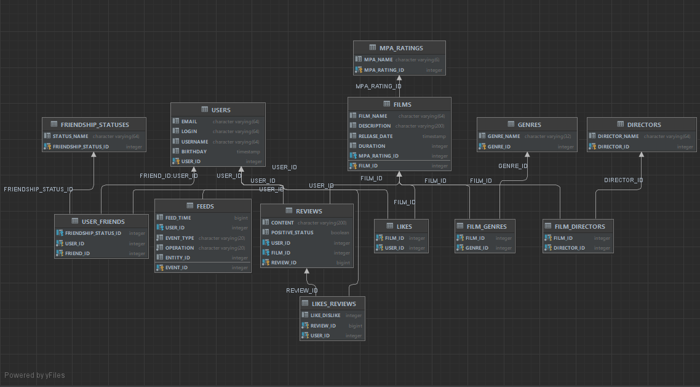

#  FILMORATE

---

***Сервис по поиску топ фильмов для просмотра.***

---

### ER-диаграмма:

https://app.quickdatabasediagrams.com/#/d/ozfp4o
  

#### Примеры SQL запросов:
- Получить список названий всех фильмов  
  ```` SQL
  SELECT name FROM film;
  
- Получить список всех пользователей  
  ```` SQL
  SELECT * FROM users

- Получить топ 10 популярных фильмов  
  ```` SQL
  SELECT name  
  FROM film AS f  
  INNER JOIN like AS l ON f.film_id = like.film_id  
  GROUP BY name  
  ORDER BY COUNT(like.user_id) DESC  
  LIMIT (10);

- Получить список id общих друзей пользователей user1 и user2  
  с id = 1 и id = 2 (id подтверждённой дружбы - 2)
  ```` SQL
  SELECT friend_id
  FROM user_friend
  WHERE user_id = 1,
        friendship_status_id = 2
      INTERSECT
  SELECT friend_id
  FROM user_friend
  WHERE user_id = 2 
        friendship_status_id = 2;  